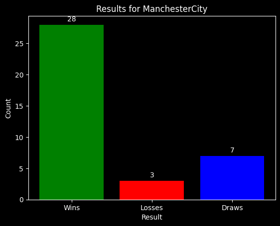
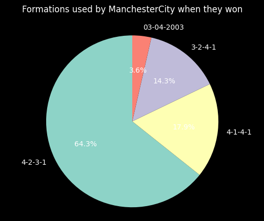
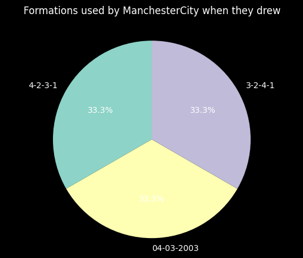

EPL data for 2023/2024 season
Refer to Notes.txt file for what the variables mean in the excel sheet

Case 1: Game wins, loss and draws for Gameweek 1 and plotting as a function of bar graph with count and result as the labels y and x respectively

GW1 Results for ManchesterCity:
Wins: 
               Team Result         Opponent         Referee
0   ManchesterCity      W          Burnley    Craig Pawson
1   ManchesterCity      W    Newcastle Utd    Robert Jones
2   ManchesterCity      W    Sheffield Utd  Jarred Gillett
3   ManchesterCity      W           Fulham  Michael Oliver
4   ManchesterCity      W         West Ham     Andy Madley
5   ManchesterCity      W  Nott'ham Forest  Anthony Taylor
8   ManchesterCity      W         Brighton    Robert Jones
9   ManchesterCity      W   Manchester Utd    Paul Tierney
10  ManchesterCity      W      Bournemouth    Craig Pawson
15  ManchesterCity      W       Luton Town    Tim Robinson
17  ManchesterCity      W          Everton     John Brooks
18  ManchesterCity      W    Sheffield Utd     David Coote
19  ManchesterCity      W    Newcastle Utd  Chris Kavanagh
20  ManchesterCity      W          Burnley  Samuel Barrott
21  ManchesterCity      W        Brentford  Jarred Gillett
22  ManchesterCity      W          Everton     John Brooks
24  ManchesterCity      W        Brentford  Darren England
25  ManchesterCity      W      Bournemouth  Jarred Gillett
26  ManchesterCity      W   Manchester Utd     Andy Madley
29  ManchesterCity      W      Aston Villa  Darren England
30  ManchesterCity      W   Crystal Palace    Paul Tierney
31  ManchesterCity      W       Luton Town     John Brooks
32  ManchesterCity      W         Brighton  Jarred Gillett
33  ManchesterCity      W  Nott'ham Forest    Simon Hooper
34  ManchesterCity      W           Wolves    Craig Pawson
35  ManchesterCity      W           Fulham  Anthony Taylor
36  ManchesterCity      W        Tottenham  Chris Kavanagh
37  ManchesterCity      W         West Ham     John Brooks
Losses: 
               Team Result     Opponent         Referee
6   ManchesterCity      L       Wolves    Craig Pawson
7   ManchesterCity      L      Arsenal  Michael Oliver
14  ManchesterCity      L  Aston Villa     John Brooks
Draws: 
               Team Result        Opponent         Round         Referee
11  ManchesterCity      D         Chelsea  Matchweek 12  Anthony Taylor
12  ManchesterCity      D       Liverpool  Matchweek 13  Chris Kavanagh
13  ManchesterCity      D       Tottenham  Matchweek 14    Simon Hooper
16  ManchesterCity      D  Crystal Palace  Matchweek 17    Paul Tierney
23  ManchesterCity      D         Chelsea  Matchweek 25     Andy Madley
27  ManchesterCity      D       Liverpool  Matchweek 28  Michael Oliver
28  ManchesterCity      D         Arsenal  Matchweek 30  Anthony Taylor

Case 2 : Formations used by Manchester City during the season and plotting it against the formation used

